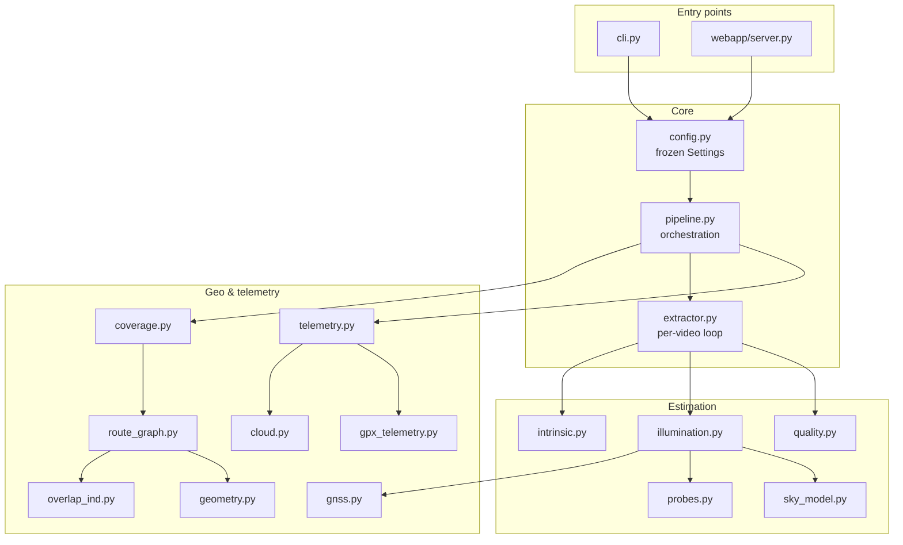
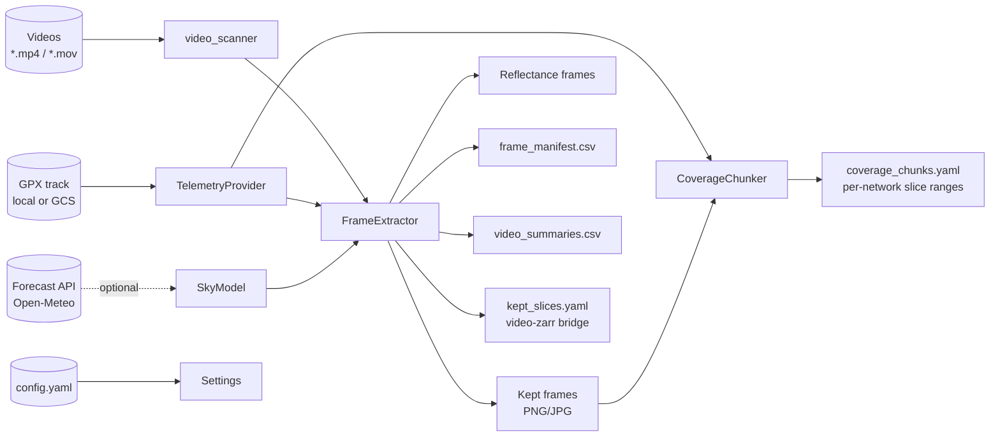
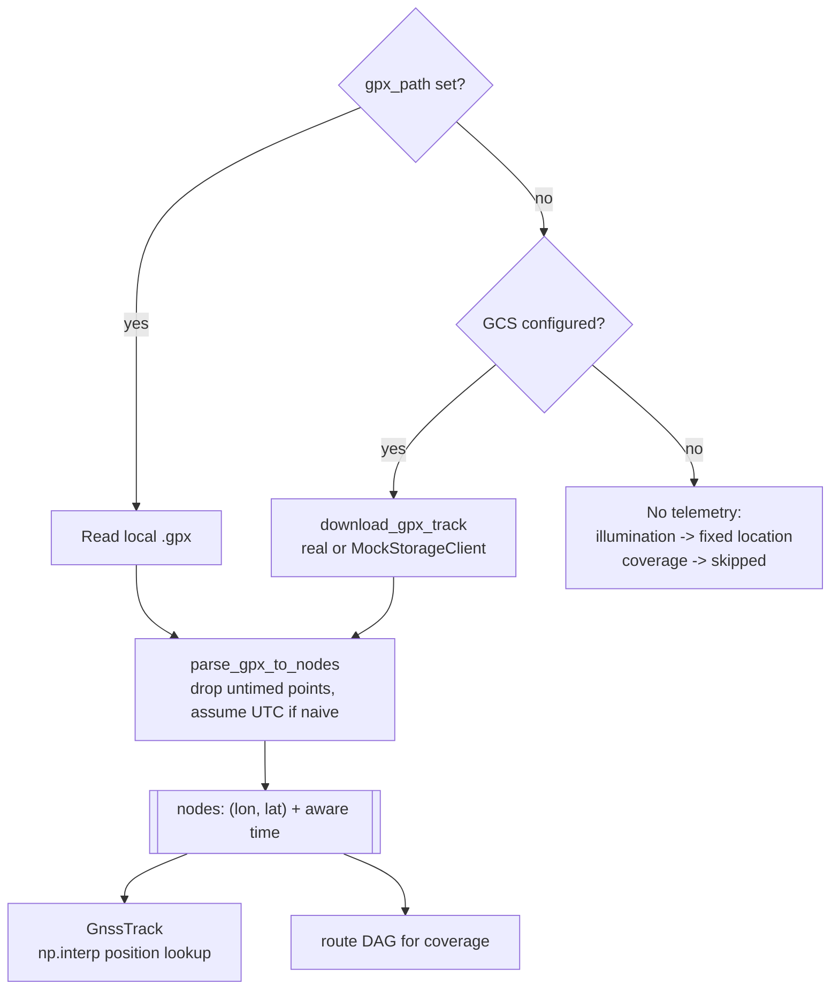
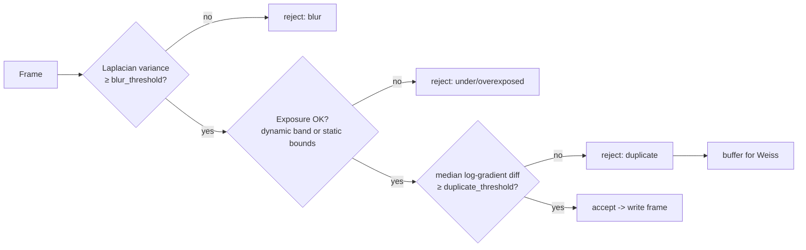
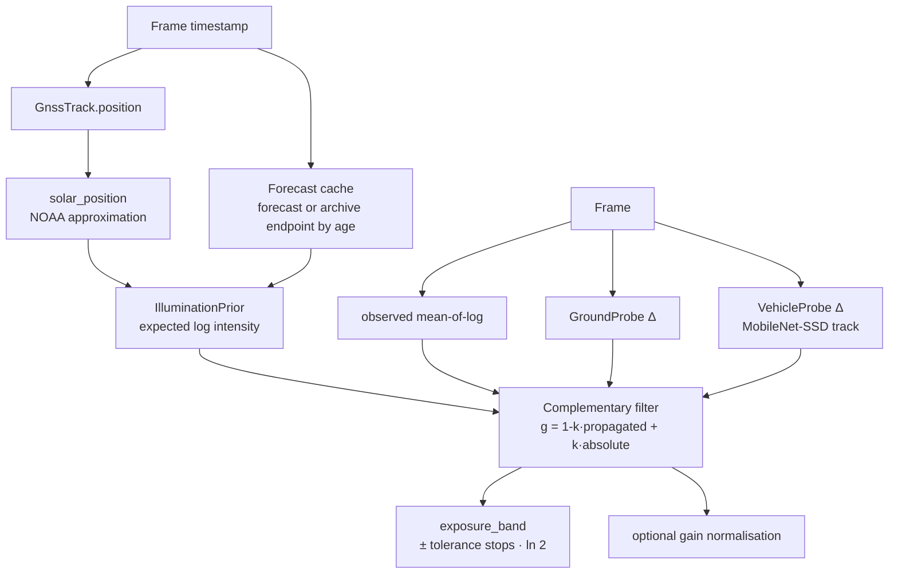
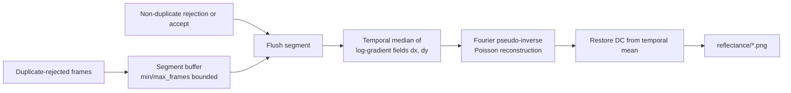
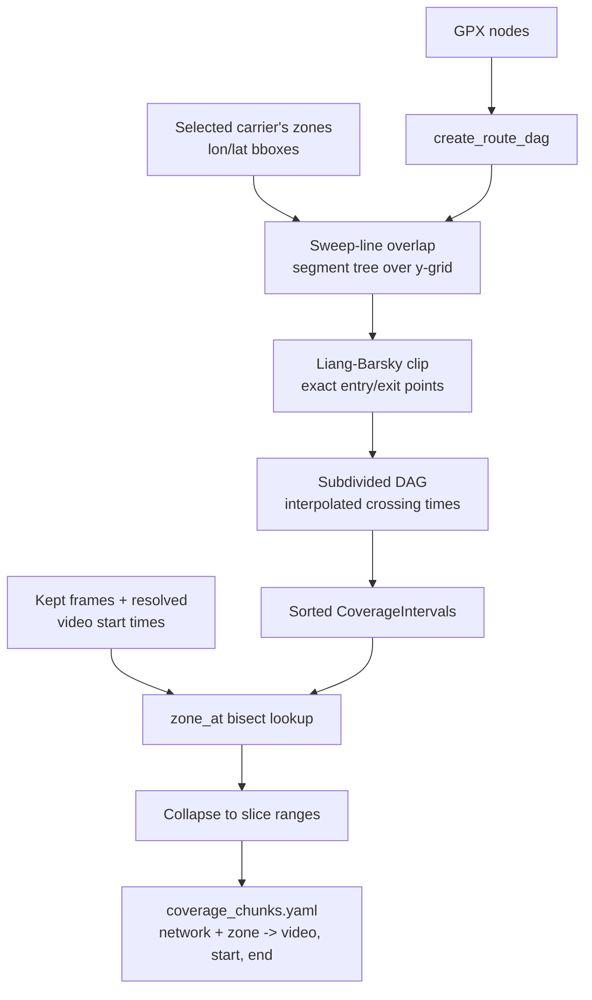
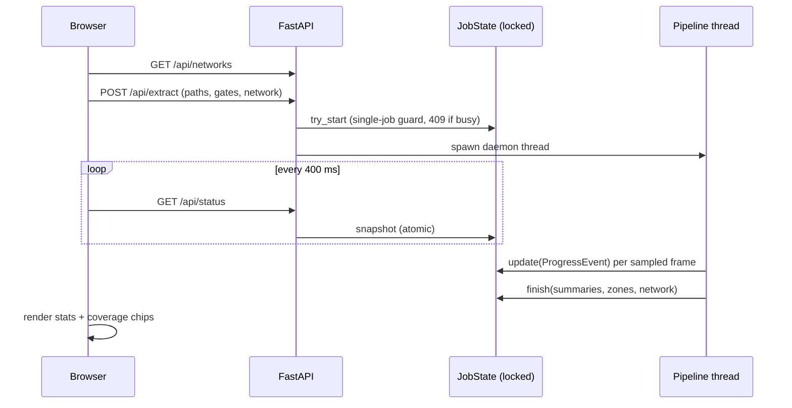

# Cloud_Dashcam_POC

Quality-gated, illumination-aware, coverage-chunked frame extraction from vehicle-mounted video. Built at the intersection of classical computer vision and geospatial telemetry — no neural networks required for the core pipeline.

<a name="top"></a>

## Contents

- [Key concepts](#key-concepts)
- [Architecture overview](#architecture-overview)
- [Data flow: input to outputs](#data-flow)
- [Telemetry subsystem](#telemetry-subsystem)
- [Quality gates](#quality-gates)
- [Illumination estimation](#illumination-estimation)
- [Weiss reflectance recovery](#weiss-reflectance-recovery)
- [Coverage chunking](#coverage-chunking)
- [Web control panel](#web-control-panel)
- [Configuration](#configuration)
- [Installation](#installation)
- [Running](#running)
- [Testing](#testing)
- [Outputs](#outputs)
- [Known limitations](#known-limitations)
- [References](#references)
- [Figma Draft of UX (and other ref figures of test)](#Figma Draft of UX (and other ref figures of test))

---

<a name="key-concepts"></a>
## Key concepts

- **Config-driven, immutable settings** — every tunable lives in `config.yaml`, loaded into frozen dataclasses with fail-fast validation; module code contains no magic numbers (NASA Power of 10, rule 8) [[3]](#references).
- **Single telemetry source of truth** — one GPX track (local or GCS) feeds *both* illumination and coverage chunking, so the two subsystems can never disagree about vehicle position.
- **Log-domain duplicate detection** — global exposure change is additive in log space and vanishes under differentiation, so static scenes are detected robustly under auto-gain (after Weiss, 2001 [[1]](#references)).
- **Physics-based exposure gating** — a sky model (NOAA solar geometry [[2]](#references) + Open-Meteo cloud forecast [[4]](#references)) predicts expected brightness per frame; exposure rejection adapts to time-of-day and weather rather than using fixed thresholds.
- **Coverage-aware chunking** — kept frames are partitioned into per-carrier network-coverage windows via sweep-line rectangle overlap + Liang–Barsky clipping [[5]](#references), producing upload-ready slice ranges.
- **Offline-first testing** — injectable collaborators (mock GCS client, mocked DNN, forecast stubs) mean the full suite runs with no network.

[back to top](#top)

---

<a name="architecture-overview"></a>
## Architecture overview



- `pipeline.py` resolves telemetry **once**, fans out to per-video extraction (sequential or `ProcessPoolExecutor`), then runs coverage chunking as a post-pass.
- Estimation modules are wired by `extractor.py` from settings; each is independently disableable.

[back to top](#top)

---

<a name="data-flow"></a>
## Data flow: input to outputs



- **Inputs**: video directory, GPX telemetry, `config.yaml`, optional hourly cloud forecast.
- **Per-frame path**: sample → crop → illumination prior → quality gates → write or reject.
- **Outputs**: images, reflectance frames, CSV manifests, and two YAML bridges (`kept_slices.yaml` for video-zarr, `coverage_chunks.yaml` for upload scheduling). See [Outputs](#outputs).

[back to top](#top)

---

<a name="telemetry-subsystem"></a>
## Telemetry subsystem

`telemetry.py` · `gpx_telemetry.py` · `cloud.py` · `gnss.py`



- Resolved **once per run**, cached on the provider; both consumers receive the identical node list.
- `GnssTrack` enforces monotonic timestamps and answers position queries within `gnss_tolerance_s`; outside the track it returns `None` (illumination skips the frame).
- Failure degrades gracefully: illumination falls back to `fixed_lat/lon`; coverage chunking is skipped rather than computed against a guessed position.

[back to top](#top)

---

<a name="quality-gates"></a>
## Quality gates

`quality.py` — sequential, first-failure short-circuits; the gradient baseline updates on **every** evaluated frame so it never goes stale across rejected stretches.



- **Blur**: variance of the Laplacian on a downscaled grayscale analysis image.
- **Exposure**: when illumination is active, the check compares the frame's *mean-of-log* intensity against a predicted band (matching the estimator's statistic — not log-of-mean, avoiding the Jensen gap); otherwise static linear thresholds apply.
- **Duplicate**: median absolute difference of Sobel log-gradient images — invariant to global gain changes [[1]](#references).

[back to top](#top)

---

<a name="illumination-estimation"></a>
## Illumination estimation

`illumination.py` · `sky_model.py` · `probes.py`



- The state `g` (log gain) tracks the offset between observed and physically expected brightness; probe deltas propagate it frame-to-frame (low noise), the full-frame observation pulls it toward absolute (weight `fusion_gain`).
- Historical footage automatically routes to the Open-Meteo **archive** endpoint (`forecast_max_past_days`) [[4]](#references); forecast failure degrades to geometry-only priors with a one-time warning.
- Constants are camera-fittable via `scripts/calibrate_sky_model.py`.

[back to top](#top)

---

<a name="weiss-reflectance-recovery"></a>
## Weiss reflectance recovery

`intrinsic.py` — runs only on static segments detected by the duplicate gate (its stationarity assumption).



- Implements the ML estimator from Weiss (2001) [[1]](#references): illumination edges are sparse and transient, so the temporal median of log-gradients isolates constant reflectance.
- Segments are flushed on any non-duplicate rejection, so frames from different static scenes are never merged into one estimate.

[back to top](#top)

---

<a name="coverage-chunking"></a>
## Coverage chunking

`coverage.py` · `route_graph.py` · `geometry.py` · `overlap_ind.py`



- The carrier is selected via `coverage.network` (config), CLI, or the web UI's network dropdown; each carrier owns its own zone map.
- The sweep-line detector [[6]](#references) prunes edge-to-zone candidate pairs in `O((n+k) log n)`; Liang–Barsky [[5]](#references) then computes exact crossings, and crossing *times* are linearly interpolated along the edge.
- Output ranges reuse the same `{start, end}` collapsing as the video-zarr bridge, so downstream uploaders consume one format.

[back to top](#top)

---

<a name="web-control-panel"></a>
## Web control panel

`webapp/` — optional FastAPI app serving a dark five-screen flow (welcome → demo → configure → processing → complete).



- Gate toggles neutralise thresholds via `dataclasses.replace` (a disabled gate can never fire) and AND with the YAML — the browser can disable what config enables, never the reverse.
- Binds to `ui.host` (default `127.0.0.1`); keep it loopback unless you intend network exposure, since the API accepts filesystem paths.

[back to top](#top)

---

<a name="configuration"></a>
## Configuration

All sections in `config.yaml`, validated at load:

| Section | Owns |
|---|---|
| `sampling` | stride (frames/seconds), per-video frame cap |
| `input` | crop window, sample window, timestamp source |
| `quality` | blur / exposure / duplicate thresholds, analysis size |
| `intrinsic` | Weiss segment bounds, log epsilon |
| `telemetry` | GPX path or GCS bucket/blob, mock flag |
| `illumination` | sky-model constants, probes, fusion gain, forecast endpoints |
| `coverage` | carrier selection, per-network zone bboxes, manifest name |
| `output` | image format, manifests, video-zarr bridge export |
| `runtime` | paths, bounds, workers, failure budget |
| `ui` | web panel host/port |

CLI carries only overrides: `--videos`, `--output`, `--gpx`, `--config`.

[back to top](#top)

---

<a name="installation"></a>
## Installation

- **Prerequisites**: Python ≥ 3.11. `pymediainfo` additionally needs the native `libmediainfo` library (`apt install libmediainfo0v5` / `brew install media-info`); without it, timestamp resolution falls back to filename parsing automatically.
- **Install** (editable, with all extras):

```bash
git clone <repo-url> && cd frame-extract
python -m venv .venv && source .venv/bin/activate
pip install -e ".[metadata,ui,coverage,dev]"
```

- Extras: `metadata` (container timestamps/GPS), `ui` (web panel), `coverage` (GPX + chunking — effectively required, the pipeline imports it at module load), `gcs` (real Google Cloud Storage client), `dev` (pytest + httpx).
- Verify the install: `pytest -x` (generates `test_data/` fixtures on first run, fully offline).

[back to top](#top)

---

<a name="running"></a>
## Running

### Quick start (synthetic demo)

```bash
python scripts/make_test_data.py          # writes test_data/videos + test_data/track.gpx
frame-extract --videos test_data/videos --output extracted_frames \
              --gpx test_data/track.gpx
```

- Inspect results under `extracted_frames/`: kept frames per video, `frame_manifest.csv`, `video_summaries.csv`, per-video `kept_slices.yaml`. See [Outputs](#outputs).
- To exercise coverage chunking on the demo, set `coverage.enabled: true` in `config.yaml` first — the fixture track deliberately crosses the demo `vodafone` zones, so `coverage_chunks.yaml` appears alongside the manifests.

### Running on your own footage

1. **Name your files** `VEHICLE_YYYYMMDD_HHMMSS_CAMERA.ext` (e.g. `CAR01_20240315_083000_CAM01.mp4`) *or* rely on container metadata (`input.metadata_source: auto` probes `encoded_date` first, filename second). Non-conforming files still extract; they just lose illumination and coverage (no resolvable timestamp).
2. **Set the timezone** — `illumination.timezone` is the zone the filename timestamps were recorded in; container timestamps are used as-is.
3. **Point at your telemetry** — `telemetry.gpx_path` for a local track, or `gcs_bucket`/`gcs_blob` with `use_mock_gcs: false` for cloud (the same GPX drives illumination *and* coverage). No telemetry at all → illumination uses `fixed_lat`/`fixed_lon`, coverage is skipped.
4. **Pick a carrier** — `coverage.network` selects which zone map in `coverage.networks` applies.
5. **Run**:

```bash
frame-extract --config config.yaml --videos /data/survey_2024_03 \
              --output /data/extracted --gpx /data/tracks/day1.gpx
```

- The CLI carries only path overrides; every threshold lives in `config.yaml`. Tune `quality.*` against your camera, then fit the sky model (below).

### Web control panel

```bash
frame-extract-ui --config config.yaml     # open http://127.0.0.1:8321
```

- Five-screen flow: welcome → **Run local demo** (fixtures, mock telemetry, all gates) → **Select video file** (paths, GPX source, mobile network, sampling, gate toggles) → live progress → results with per-zone coverage chips.
- One job at a time (409 on concurrent launch); toggles can only *disable* what config enables. Keep `ui.host: 127.0.0.1` unless you intend network exposure — the API accepts filesystem paths.

### Parallel mode

- Set `runtime.num_workers > 0` to fan videos across a `ProcessPoolExecutor`. Trade-off: progress reporting coarsens from per-frame to per-video (callbacks don't cross process boundaries), and forecast-cache writes become last-merge-wins (harmless; entries re-fetch).

### Real GCS telemetry

```bash
export GOOGLE_APPLICATION_CREDENTIALS=/path/to/service-account.json
pip install -e ".[gcs]"
# config.yaml: telemetry.use_mock_gcs: false, gcs_bucket/gcs_blob set
frame-extract --config config.yaml
```

### Calibrating the sky model to your camera

```bash
# 1. one full day of footage, gates + illumination off in config.yaml
#    (quality.enabled: false, illumination.enabled: false)
frame-extract --videos /data/calib_day --output calib_out
# 2. fit and print YAML-ready constants
python scripts/calibrate_sky_model.py --manifest calib_out/frame_manifest.csv --plot
# 3. paste the suggested night/clear/cloud constants into config.yaml, re-enable gates
```

### Troubleshooting

| Symptom | Likely cause / fix |
|---|---|
| `Missing config section for TelemetryConfig` | `config.yaml` predates the telemetry refactor — add the `telemetry:` section |
| "no parseable timestamp; illumination disabled" | filename doesn't match the pattern and container has no date — rename or set `metadata_source: filename` off |
| `coverage_chunks.yaml` never appears | `coverage.enabled: false`, or telemetry failed to resolve (check the startup warning) |
| Everything rejected as `blur` | `blur_threshold` too high for your lens/resolution — inspect `blur_score` values in the manifest and lower it |
| Frames land one zone early/late | GPX vs camera clock drift — see [Known limitations](#known-limitations) |
| `ImportError: gpxpy`/`networkx` | install with `.[coverage]` |

[back to top](#top)

---

<a name="testing"></a>
## Testing

```bash
pytest -x
```

- Seven modules, fully offline: config/gates/extractor/pipeline, illumination + solar geometry, Weiss recovery, container metadata (MediaInfo mocked), probes (DNN mocked), coverage (geometry, graph, provider with mock GCS), webapp (pipeline patched).
- Session-scoped fixture auto-generates `test_data/` on first run.

[back to top](#top)

---

<a name="outputs"></a>
## Outputs

| Artifact | Format | Purpose |
|---|---|---|
| `<video-stem>/*.png` | image | accepted frames, metrics in filename |
| `<video-stem>/reflectance/*.png` | image | Weiss reflectance per static segment |
| `frame_manifest.csv` | CSV | per-frame metrics, timestamps + provenance, illumination state |
| `video_summaries.csv` | CSV | per-video acceptance/rejection counts |
| `<video-stem>/kept_slices.yaml` | YAML | contiguous source-frame ranges (video-zarr bridge) |
| `coverage_chunks.yaml` | YAML | network + zone → `{video, start, end}` upload windows |

[back to top](#top)

---

<a name="known-limitations"></a>
## Known limitations

- Corrupt-file frame indices may drift (a failed `read()` may or may not consume a container frame) — treat kept-slice ranges from corrupt files as approximate.
- Coverage assumes GPX and camera clocks share a time base; clock drift shifts frames across zone boundaries.
- Zone maps are hand-maintained bboxes; real carrier coverage is polygonal (upgrade path: GeoJSON + point-in-polygon, e.g. Ofcom data [[7]](#references)).
- Zone-entry slivers on subdivided edges are labelled with the entering zone (bounded by one GPX fix interval).
- Overlapping zones resolve last-split-wins / earliest-interval at lookup; use disjoint zones or add priorities.

[back to top](#top)

---

<a name="references"></a>
## References

1. Weiss, Y. (2001). *Deriving intrinsic images from image sequences.* Proc. ICCV 2001. — duplicate gate rationale, reflectance recovery, vehicle probe.
2. NOAA Global Monitoring Division. *Solar Position Calculations* (analytical approximation). — `sky_model.solar_position`.
3. Holzmann, G. J. (2006). *The Power of 10: Rules for Developing Safety-Critical Code.* IEEE Computer 39(6). — bounded loops, no magic numbers, immutability conventions.
4. Open-Meteo. *Weather Forecast & Historical Weather APIs.* https://open-meteo.com/ — cloud cover and shortwave irradiance priors.
5. Liang, Y. & Barsky, B. (1984). *A New Concept and Method for Line Clipping.* ACM TOG 3(1). — exact zone-boundary crossing points.
6. Bentley, J. L. (1977). *Algorithms for Klee's rectangle problems.* — sweep-line + segment tree overlap detection pattern.
7. Ofcom. *Mobile coverage data.* https://www.ofcom.org.uk/ — source for real UK carrier coverage maps.

[back to top](#top)


---

<a name="Figma Draft of UX (and other ref figures of test)"></a>
## Figma Draft of UX (and other ref figures of test)


[back to top](#top)
